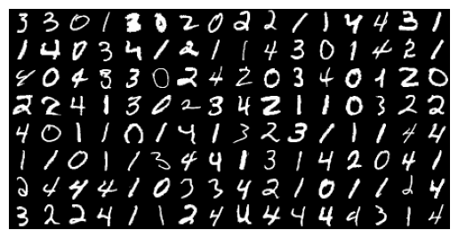
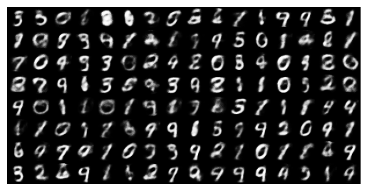
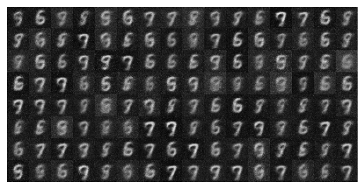

### pinned issue:
1. after adding ewc regularization, loss keeps increasing in the fine-tuning stage
	even having a large $\lambda$ doesn't help

### trivial issue:
1. GM-AM inequality and discrete jensen's inequality (log is concave) arrive at the same result

### things can be improved from the MGVAE:
1. the current objective function is computationally expensive as it requires MC sampling
2. EWC is justified for log-likelihood so is for bce but not ours

### current reults
||
|:---:|
|Original "majority" images|

||
|:---:|
|Transformed images (with pre-training)|

||
|:---:|
|Transformed images (without pre-training)|
