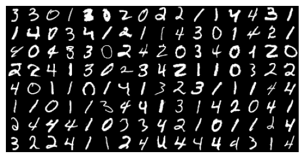
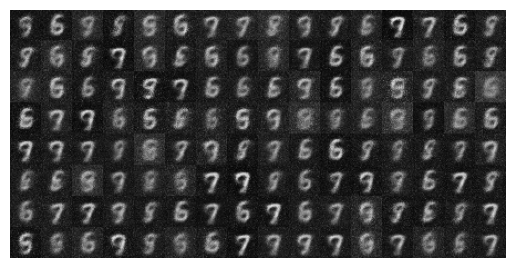

### pinned issue:
1. <s>numerical results of the two estimator contradict with the inequality derivation (the issue should be caused by `estimated` approach)</s> (Solved!)
2. gradient explosion on `logvar_major`
3. after adding ewc regularization, loss keeps increasing in the fine-tuning stage
	even having a large $\lambda$ doesn't help

### things can be improved from the MGVAE:
1. The current objective can be extended to **IWAE** 
2. EWC is okay; however, *Nguyen et al. (2017) proposed* **VCL** framework more related to the variational framework (which is cited but not implemented in MGVAE)
3. The current objective function is computationally expensive

### current reults for $\rho=100$
||
|:---:|
|Original "majority" images|

||
|:---:|
|Transformed images (with pre-training)|

||
|:---:|
|Transformed images (without pre-training)|
